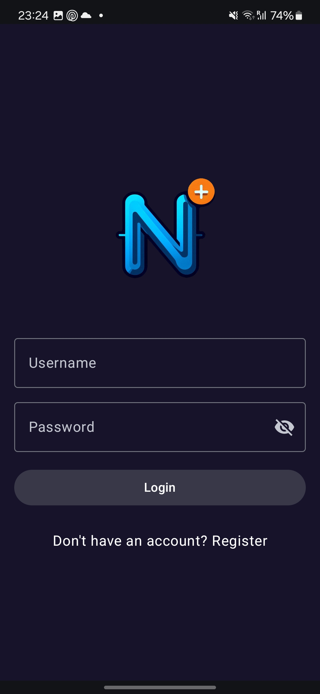
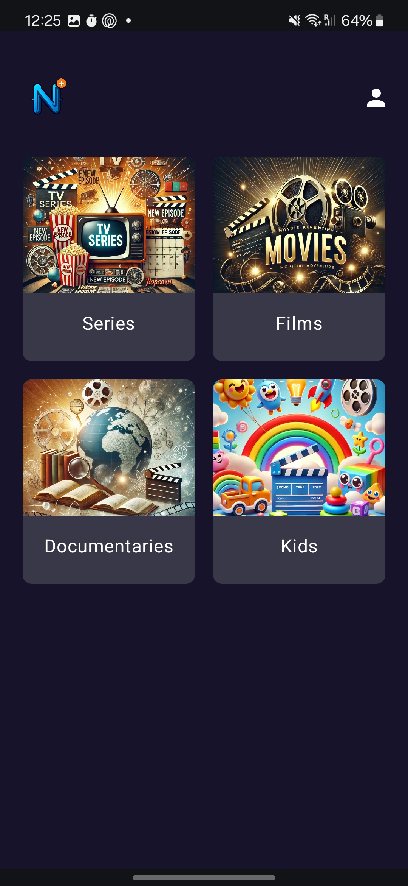
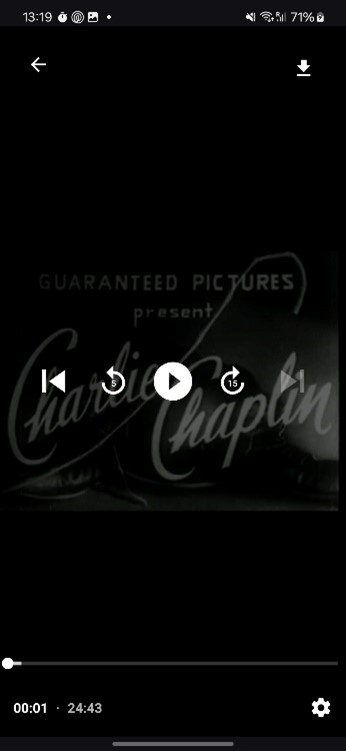

# Netflix++

**Mobile Streaming & CMS Platform**


## Description

<p align="center">
  
  
  
</p>

Netflix++ is a Netflix-style streaming application consisting of three main components:

1. **Mobile App (User App)**: A native Android client that allows users to browse, search, and play multimedia content (series, movies, documentaries, and kids content), including P2P torrent-based streaming, selectable quality, and advanced playback controls.
2. **CMS (Developer App)**: An admin-only interface for user and media management: creating/deleting users, uploading/deleting media files, all secured with JWT authentication.
3. **Backend Server**: A REST API implemented with Jetty and Jersey, secured with JWT, backed by a MariaDB database and NGINX proxy. Hosted on Google Cloud.

## Table of Contents

* [Features](#features)
* [Architecture](#architecture)
* [Technologies](#technologies)
* [Installation](#installation)
* [Usage](#usage)
* [Contributing](#contributing)
* [License](#license)
* [Authors](#authors)

## Features

### Mobile App

* Custom splash screen with logo.
* User authentication (Login/Register).
* Browse by category: Series, Movies, Documentaries, Kids.
* Real-time title search with live filtering.
* Video playback via local torrent protocol or direct server streaming.
* Selectable video quality (low/high) and download management.
* Advanced playback controls: pause, seek, playback speed, and audio selection.

### CMS (Developer App)

* User management: create (admin/manual), delete, and list users.
* Media management: upload files, generate HLS/MP4 in 1080p and 360p, and delete media.

### Backend Server

* NGINX proxy forwarding HTTP requests (port 80) to Jetty server (port 8080).
* REST endpoints under `/users` and `/media`, secured by JWT.
* MariaDB database (`streaming_service`) with `Users` and `Media` tables.
* JWT tokens with 30-minute expiration.

## Architecture

```plaintext
┌──────────────┐       ┌─────────────┐       ┌────────────┐
│   Mobile &   │<----->│   Server    │<----->│  Database  │
│     CMS      │ JWT   │ Jetty+Jersey│  SQL  │  MariaDB   │
└──────────────┘ HTTP   └─────────────┘       └────────────┘
                              ▲
                              │
                           ┌──┴──┐
                           │NGINX│
                           └─────┘
```

## Technologies

* **Mobile**: Android (Java/Kotlin), Android Studio
* **Backend**: Java, Jetty, Jersey, JWT
* **Database**: MariaDB
* **Proxy**: NGINX
* **Hosting**: Google Cloud Platform
* **Version Control**: Git & GitHub

## Installation

1. Clone this repository:

   ```bash
   git clone https://github.com/Ignacio003/netflix.git
   cd netflix
   ```
2. **Backend**:

   * Navigate to the `server/` directory.
   * Configure `application.properties` with your database credentials and `SECRET_KEY` for JWT.
   * Start the server:

     ```bash
     mvn clean install
     mvn exec:java -Dexec.mainClass="com.streaming.Main"
     ```
3. **Database**:

   * Create the `streaming_service` database in MariaDB.
   * Run the SQL script located at `server/db/schema.sql`.
4. **Mobile App**:

   * Open the `mobile/` project in Android Studio.
   * Update the server URL in `Constants.java`.
   * Build and run on an emulator or physical device.
5. **CMS App**:

   * Open the `cms/` project in Android Studio (or your preferred IDE).
   * Configure and run similarly to the mobile app.

## Usage

1. Ensure the backend server is running and MariaDB is available.
2. Launch the mobile app, register a user, or log in with admin credentials.
3. Browse categories, search, and play content.
4. For administrative tasks, open the CMS app using the admin login.

## Contributing

1. Fork this repository.
2. Create a branch (`git checkout -b feature/your-feature-name`).
3. Make your changes with clear, descriptive commits.
4. Submit a Pull Request detailing your modifications.

## License

This project is licensed under the [MIT License](LICENSE).

## Authors

* **Mateo Bouchet Agudo**
* **Ignacio Fortes Soria**

Thank you for your interest in Netflix++! If you have any questions, feel free to open an issue or contact the authors.
